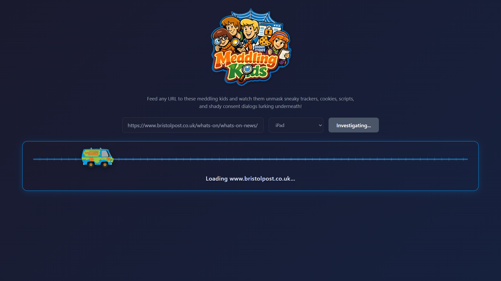
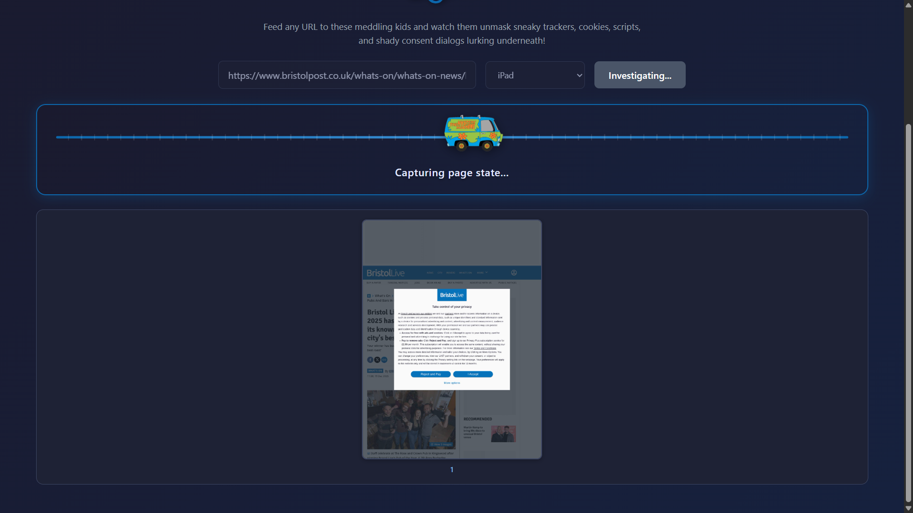
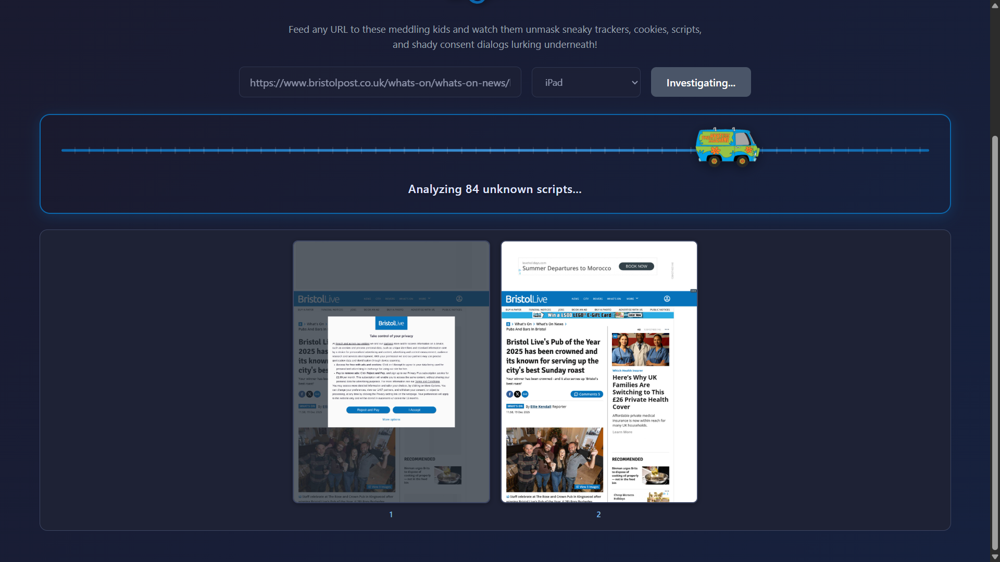
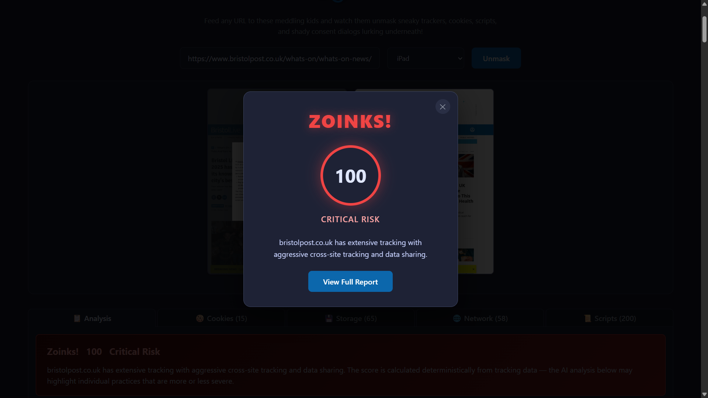
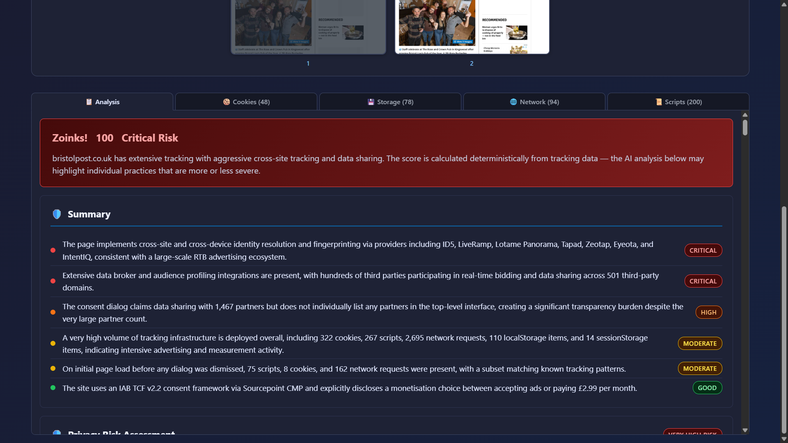

# Meddling Kids


Zoinks! There's something spooky going on with these websites... but don't worry, gang! This mystery-solving machine pulls the mask off sneaky trackers and exposes the villain underneath. Feed it any URL and watch as we unmask those cookies, scripts, network requests, and shady consent dialogs. And we would have never figured it out if it wasn't for those meddling kids!


## Features

- 📸 **Screenshot Timeline** — Captures page state at initial load, after consent, and final
- 📱 **Device Emulation** — Test as iPhone, iPad, Android, Windows Chrome, or macOS Safari
- 📋 **Consent Dialog Extraction** — Reads and reports cookie consent banner details
- 🌐 **Real-time URL Analysis** — Enter any URL and watch as tracking is exposed in real-time
- 🎯 **Privacy Score** — Scooby-Doo themed privacy rating (Zoinks! to Scoob-tastic!)
- 🍪 **Cookie Detection** — Identifies all cookies including third-party trackers
- 📜 **Script Tracking** — Lists all JavaScript files with smart grouping for app chunks and vendor bundles
- 🔄 **Network Monitoring** — Captures HTTP requests with third-party filtering
- 💾 **Storage Inspection** — Reveals localStorage and sessionStorage usage
- 🤖 **AI-Powered Analysis** — Uses Microsoft Agent Framework with Azure OpenAI to analyze privacy implications
- ⚡ **Smart Caching** — Caches script analysis, domain knowledge, and overlay strategies to reduce LLM calls and speed up repeat analyses

## How It Works

1. **URL Submission** — User enters a URL and selects a device type to emulate
2. **Browser Automation** — Playwright launches real Chrome (with Chromium fallback) in headed mode on a virtual display, with anti-bot hardening to avoid detection
3. **Real-time Streaming** — Results stream to the UI via Server-Sent Events
4. **Access Check** — Detects bot protection or access denied responses
5. **Consent Detection** — AI analyzes the page for cookie consent dialogs
6. **Consent Interaction** — Attempts to click "Accept All" and captures changes
7. **Data Collection** — Captures cookies, scripts, network requests, and storage
8. **Privacy Score** — Generates a 0-100 privacy score with Scooby-Doo themed rating
9. **Privacy Analysis** — AI reviews collected data for privacy concerns

## Example Analysis Walkthrough

Let's take a look at a page from the Daily Mail (a site known for heavy tracking). Here's what the original page looks like. Wowzers! I wonder what is going on behind the scenes...


---

So let's run an analysis and see what Meddling Kids uncovers!



---

First we load up the intial page and see if it has any consent dialogs. If so we will attempt to accept consent and all cookies and track the changes.



---

Once we've detected and dismissed the consent dialog, we can see the final loaded page and we can start the analysis. If there are multiple stages, the screenshots will show each step.



---

After the analysis is complete, we get a privacy score out of 100 based on the tracking detected. The score ranges from "Zoinks!" for poor privacy to "Scoob-tastic!" for excellent privacy.



---

If you want to dive deeper, we get a full report showing all cookies, scripts, network requests, storage items, and AI analysis.



---

## Tech Stack

| Layer | Technology |
|-------|------------|
| Frontend | Vue 3, TypeScript, Vite |
| Backend | Python, FastAPI, Microsoft Agent Framework |
| Browser Automation | Playwright for Python with real Chrome (headed mode on Xvfb virtual display) |
| Communication | Server-Sent Events (SSE) |

## Architecture

```
meddlingkids/
├── client/                    # Vue.js 3 frontend
│   ├── src/
│   │   ├── components/        # UI components (tabs, gallery, progress)
│   │   ├── composables/       # State management (useTrackingAnalysis)
│   │   ├── types/             # TypeScript interfaces
│   │   └── utils/             # Formatting utilities
│   └── public/                # Static assets
├── server/                    # Python FastAPI backend
│   ├── pyproject.toml         # Python dependencies (managed with uv)
│   └── src/
│       ├── main.py            # FastAPI application entry point
│       ├── agents/            # AI agents (Microsoft Agent Framework)
│       │   └── prompts/       # System prompts (one module per agent)
│       ├── browser/           # Browser automation (Playwright session, device configs)
│       ├── consent/           # Consent handling (detect, click, extract, classify, cache)
│       ├── analysis/          # Tracking analysis, script ID, privacy scoring, caching
│       │   └── scoring/       # Decomposed privacy scoring (8 category scorers + calculator)
│       ├── pipeline/          # SSE streaming orchestration (phases 1-5)
│       │   └── overlay_steps.py  # Sub-step functions for overlay pipeline
│       ├── models/            # Pydantic data models
│       ├── data/              # Static pattern databases (JSON)
│       │   ├── partners/      # Partner risk databases (8 JSON files)
│       │   └── trackers/      # Script pattern databases (2 JSON files)
│       └── utils/             # Cross-cutting utilities (logging, errors, URL, images, cache mgmt)
├── .logs/                     # Server logs (auto-created when WRITE_TO_FILE=true)
├── .reports/                  # Analysis reports (auto-created when WRITE_TO_FILE=true)
├── .cache/                    # Analysis caches (auto-created)
│   ├── domain/                # Domain knowledge cache for cross-run consistency
│   ├── overlay/               # Overlay dismissal cache per domain
│   └── scripts/               # Script analysis cache (URL + content hash)
├── Dockerfile                 # Multi-stage production build
└── vite.config.ts             # Vite build configuration
```

## Caching

Meddling Kids uses three per-domain caches stored in `server/.cache/`
to speed up repeat analyses and reduce LLM calls. Cache files are
JSON, created automatically, and gitignored.

| Cache | Directory | What It Stores | Saves |
|-------|-----------|---------------|-------|
| **Script analysis** | `.cache/scripts/` | LLM-generated descriptions of unknown scripts, keyed by URL and MD5 content hash | LLM calls for every previously analysed script whose content has not changed |
| **Domain knowledge** | `.cache/domain/` | Tracker categories, cookie groupings, vendor roles, and severity levels from prior analyses | Consistency — anchors the LLM to established labels so classifications stay stable across runs |
| **Overlay dismissal** | `.cache/overlay/` | Successful consent-dismiss strategies (Playwright locator strategy, button text, frame type) | LLM vision calls for overlay detection on repeat visits |

### How It Helps

- **Fewer LLM calls** — On a warm run the script analysis cache
  serves all previously seen scripts from disk. In testing against
  a large news site, a cold run made 72 LLM script calls while
  subsequent warm runs made zero.
- **Faster analysis** — Skipping those LLM calls reduced total
  analysis time by approximately 14%.
- **Consistent results** — The domain knowledge cache injects prior
  classifications into the LLM context, keeping tracker names,
  cookie categories, and vendor roles stable across runs.
- **Automatic invalidation** — Script cache entries are invalidated
  when the content hash changes. Domain cache entries not seen for 3
  consecutive scans are pruned. Overlay entries whose clicks fail
  are dropped on merge.

### Clearing the Cache

To clear all caches before a run, add `?clear-cache=true` to the
page URL in the browser:

```
http://localhost:5173/?clear-cache=true
```

Or pass it directly in the API URL:

```
/api/open-browser-stream?url=https://example.com&device=ipad&clear-cache=true
```

## How to Run Locally

### Prerequisites

- **Python 3.13+** with [uv](https://docs.astral.sh/uv/) package manager (for the server)
- **Node.js 22+** (for building the Vue client)
- **Azure OpenAI** or **OpenAI** account with API access to a model with **vision capabilities** (e.g., `gpt-5.2-chat`). Vision is required for consent dialog detection via screenshot analysis.

### 1. Clone and Install

```bash
git clone https://github.com/irarainey/meddlingkids.git
cd meddlingkids
npm install          # Install client dependencies
cd server && uv sync # Install server dependencies
cd ..
```

### 2. Configure Environment

```bash
cp .env.example .env
```

Edit `.env` with your OpenAI credentials. The app supports both Azure OpenAI and standard OpenAI. The configured model **must support vision** (image input) — consent dialog detection relies on screenshot analysis.

**Option A: Azure OpenAI**
```env
AZURE_OPENAI_ENDPOINT=https://your-resource.openai.azure.com/
AZURE_OPENAI_API_KEY=your-api-key
AZURE_OPENAI_DEPLOYMENT=gpt-5.2-chat
# OPENAI_API_VERSION=2024-12-01-preview  # Optional, shown is the default
```

**Option B: Standard OpenAI**
```env
OPENAI_API_KEY=your-api-key
OPENAI_MODEL=gpt-5.2-chat
```

**Optional: File Output**
```env
# Write server logs and analysis reports to files
WRITE_TO_FILE=true
```

### 3. Run Development Server

Start the client and server in separate terminals:

```bash
# Terminal 1: Start the Vite client dev server
npm run dev
```

```bash
# Terminal 2: Start the FastAPI/uvicorn server
cd server
uv run uvicorn src.main:app --reload --port 3001 --env-file ../.env
```

- **Client**: http://localhost:5173 (Vite dev server)
- **Server**: http://localhost:3001 (FastAPI with uvicorn)

## Docker Deployment

The application is available as a pre-built Docker image from GitHub Container Registry.

### Quick Start (Recommended)

Pull and run the latest image:

**Azure OpenAI:**
```bash
docker run -p 3001:3001 \
  -e AZURE_OPENAI_ENDPOINT=https://your-resource.openai.azure.com/ \
  -e AZURE_OPENAI_API_KEY=your-api-key \
  -e AZURE_OPENAI_DEPLOYMENT=gpt-5.2-chat \
  ghcr.io/irarainey/meddlingkids:latest
```

**Standard OpenAI:**
```bash
docker run -p 3001:3001 \
  -e OPENAI_API_KEY=your-api-key \
  -e OPENAI_MODEL=gpt-5.2-chat \
  ghcr.io/irarainey/meddlingkids:latest
```

Then open http://localhost:3001 to access the app.

### Using an Environment File

Create a `.env` file with your credentials and run:

```bash
docker run -p 3001:3001 --env-file .env ghcr.io/irarainey/meddlingkids:latest
```

### Using a Custom Port

To run on a different port (e.g., 8080):

```bash
docker run -p 8080:8080 -e UVICORN_PORT=8080 --env-file .env ghcr.io/irarainey/meddlingkids:latest
```

### Build Locally (Optional)

If you prefer to build the image yourself:

```bash
docker build -t meddlingkids .
docker run -p 3001:3001 --env-file .env meddlingkids
```

> **Note:** The Docker container automatically starts Xvfb (virtual display) to allow the browser to run in headed mode without a visible window. This enables ads to load correctly, as ad networks often block headless browsers.

## Available Scripts

### npm (from project root)

| Command | Description |
|---------|-------------|
| `npm run dev` | Start the Vite client dev server |
| `npm run build` | Build the client for production |
| `npm run preview` | Preview the production build |
| `npm run lint` | Check for TypeScript/Vue lint errors |
| `npm run lint:fix` | Auto-fix TypeScript/Vue lint errors |

### poe (from `server/` directory)

| Command | Description |
|---------|-------------|
| `poe lint` | Run all Python linting (ruff check + format check + mypy) |
| `poe lint:ruff` | Run ruff linter and format check only |
| `poe lint:mypy` | Run mypy type checking only |
| `poe format` | Auto-fix ruff lint issues and format code |

## Project Documentation

- [Developer Guide](DEVELOPER_GUIDE.md) — Application workflow, data flow, and architecture
- [Client README](client/README.md) — Frontend architecture, components, and styling
- [Server README](server/README.md) — Backend architecture, domain packages, and API

## License

MIT License - see [LICENSE](LICENSE) for details.