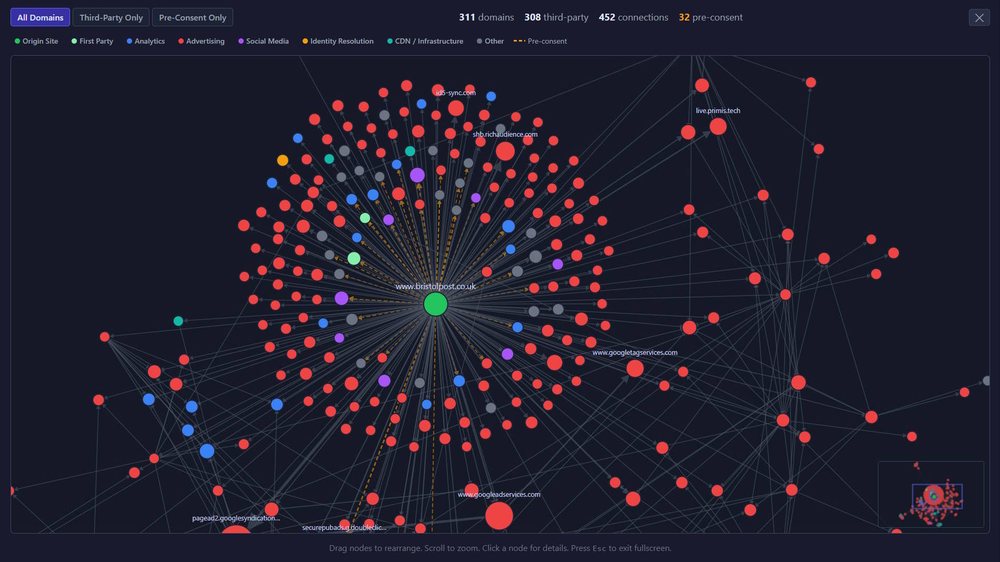

Zoinks! There's something spooky going on with these websites... but don't worry, gang! This mystery-solving machine pulls the mask off sneaky trackers and exposes the villain underneath. Feed it any URL and watch as we unmask those cookies, scripts, network requests, and shady overlays. And we would have never figured it out if it wasn't for those meddling kids!


> **Note:** This tool is primarily focused on UK-based media publishers. Its built-in databases of media group profiles, consent platforms, and partner risk classifications are curated for the UK publishing landscape. While it can analyze any publicly accessible URL, the deepest insights — including CMP detection, known-vendor enrichment, and media-group-specific context — target UK news and media sites.

## Features

- 📸 **Screenshot Timeline** — Captures page state at initial load, after consent, and final
- 📱 **Device Emulation** — Test as iPhone, iPad, Android Phone, Android Tablet, Windows Chrome, or macOS Safari
- 📋 **Overlay & Consent Detection** — Detects page overlays (cookie consent, sign-in, newsletter, paywall) and extracts consent details using three-tier extraction (LLM vision → text-only LLM fallback → local regex parser) with screenshot cropping to the dialog bounding box
- 📋 **"What You Agreed To" Digest** — Plain-language summary of what clicking Accept means in practice, written for non-technical users — highlights how many companies can track you, what data is collected, and whether data brokers are involved
- ⚖️ **Your Rights Note** — When TCF or a consent platform is detected, a deterministic note explains the user's GDPR rights including how to withdraw consent and where to find cookie settings
- 🌐 **Real-time URL Analysis** — Enter any URL and watch as tracking is exposed in real-time
- 🎯 **Privacy Score** — Scooby-Doo themed privacy rating (Zoinks! to Scoob-tastic!)
- 🍪 **Cookie Detection** — Identifies all cookies including third-party trackers. Click any cookie for an instant explanation (database-first, LLM fallback)
- 📜 **Script Tracking** — Lists all JavaScript files with smart grouping for app chunks and vendor bundles. Click any script URL to view its source code in a fullscreen dialog with syntax highlighting and automatic formatting of minified code
- 🔄 **Network Monitoring** — Captures HTTP requests with third-party filtering and initiator domain tracking
- 🕸️ **Tracker Graph** — Interactive force-directed network graph showing domain-to-domain tracker relationships, with view modes (all, third-party only, pre-consent only), clickable category filters (analytics, advertising, social, identity, session replay, consent management, CDN, first-party), first-party domain alias recognition, subdomain prefix heuristics, Disconnect override corrections, minimap navigation, resource-type breakdown, and country flag icons on nodes and connections
- 🌍 **IP Geolocation** — Country flag icons on Network, Scripts, and Tracker Graph tabs showing where each domain's server IP is registered. Uses the DB-IP Lite database (CC BY 4.0) — auto-downloaded on first startup. Hover for full country name
- 💾 **Storage Inspection** — Reveals localStorage and sessionStorage usage. Click any storage key for an instant explanation (database-first, LLM fallback)
- 🎯 **TCF Purpose Breakdown** — Maps consent purposes to the IAB TCF v2.2 taxonomy with risk levels, lawful bases, and human-readable explanations
- 🔓 **TC String Decoding** — Decodes IAB TCF v2 consent strings (euconsent-v2) to reveal purpose consents, vendor consents, legitimate interest signals, and CMP metadata
- 🔓 **AC String Decoding** — Decodes Google Additional Consent strings (addtl_consent) to expose Google ATP provider opt-ins
- 🏢 **Vendor Enrichment** — Resolves vendor IDs to names using the IAB Global Vendor List (1,111 vendors) and Google ATP provider list (598 providers)
- 🍪 **Cookie Decoders** — Automatically decodes structured cookies (OneTrust, Cookiebot, Google Analytics, Facebook Pixel, Google Ads, USP/GPC/DNT signals, GPP strings) into human-readable breakdowns
- 🤖 **AI-Powered Analysis** — Uses Microsoft Agent Framework with Azure OpenAI to analyze privacy implications
- ⚡ **Smart Caching** — Caches script analysis by script domain (cross-site), domain knowledge, and overlay strategies to reduce LLM calls and speed up repeat analyses

## How It Works

1. **URL Submission** — User enters a URL and selects a device type to emulate
2. **Browser Automation** — A shared Playwright Chrome instance (started once at app startup) creates an isolated BrowserContext per request (~50 ms), with anti-bot hardening to avoid detection
3. **Real-time Streaming** — Results stream to the UI via Server-Sent Events
4. **Access Check** — Detects bot protection or access denied responses
5. **Overlay Detection** — AI analyzes the page for overlays (cookie consent, sign-in, newsletter, paywall, age verification)
6. **Overlay Interaction** — Attempts to dismiss detected overlays and captures changes. Consent dialog screenshots are cropped to the dialog bounding box before AI extraction. If the vision call times out, a text-only LLM fallback is attempted before falling to the local regex parser
7. **Data Collection** — Captures cookies, scripts, network requests, and storage
8. **Privacy Score** — Generates a 0-100 privacy score with Scooby-Doo themed rating
9. **Privacy Analysis** — AI reviews collected data for privacy concerns

## Example Analysis Walkthrough

Let's take a look at a page from Bristol Live (a Reach Media news site known for heavy tracking). Here's what the original page looks like. Wowzers! That's a lot of screen estate taken up by ads. What is going on behind the scenes here I wonder...


---

So let's run an analysis scan and see what those Meddling Kids can uncover!


---

First we load up the initial page and see if it has any overlays such as consent dialogs, sign-in prompts, or paywall popups. If so we will attempt to dismiss them and then track the changes.


---

Once we've detected and dismissed any overlays, we get to see the final loaded page and we can then start analysis. If there are multiple dialog stages, the screenshots will show each step.


---

After the analysis is complete, we get a privacy score out of 100 based on the tracking detected. The score ranges from "Zoinks!" for poor privacy to "Scoob-tastic!" for excellent privacy.


---

If you want to dive deeper, we get a full report showing analysis, consent, cookies, storage items, network requests, and scripts.


---

And if you want an even deeper dive, we provide a detailed visualization and interactive graph to explore network traffic for tracker relationships and data flows.



---

## Tech Stack

| Layer | Technology |
|-------|------------|
| Frontend | Vue 3, TypeScript, Vite, D3.js |
| Backend | Python, FastAPI, Microsoft Agent Framework |
| Browser Automation | Playwright for Python with shared Chrome singleton (headed mode on Xvfb virtual display, per-request BrowserContext) |
| Communication | Server-Sent Events (SSE) |

## Architecture

```
meddlingkids/
├── client/                    # Vue.js 3 frontend
│   ├── src/
│   │   ├── components/        # UI components (tabs, gallery, progress, script viewer)
│   │   ├── composables/       # State management (useTrackingAnalysis)
│   │   ├── types/             # TypeScript interfaces
│   │   └── utils/             # Formatting utilities
│   └── public/                # Static assets
├── server/                    # Python FastAPI backend
│   └── src/
│       ├── main.py            # FastAPI application entry point
│       ├── agents/            # AI agents (Microsoft Agent Framework)
│       │   ├── prompts/       # System prompts (one module per agent)
│       ├── browser/           # Browser automation (PlaywrightManager singleton, per-request BrowserSession, device configs)
│       ├── consent/           # Consent handling (detect, click, extract, classify, cache, CMP platform detection)
│       ├── analysis/          # Tracking analysis, script ID, privacy scoring, TC/AC string decoding, cookie decoders, vendor enrichment, caching, IP geolocation
│       │   └── scoring/       # Decomposed privacy scoring (8 category scorers + calculator)
│       ├── pipeline/          # SSE streaming orchestration (phases 1-6)
│       ├── models/            # Pydantic data models
│       ├── data/              # Static data and reference databases (JSON)
│       │   ├── consent/       # Consent and GDPR/TCF reference data (CMP profiles, GVL vendors, Google ATP providers, consent cookies, lawful bases, purposes)
│       │   ├── geo/           # Downloaded DB-IP Lite CSV (auto-downloaded, gitignored)
│       │   ├── partners/      # Partner risk databases (8 JSON files, 574 entries)
│       │   ├── publishers/    # Media group profiles (16 UK media groups)
│       │   └── trackers/      # Tracking pattern databases (7 JSON files)
│       └── utils/             # Cross-cutting utilities (logging, errors, URL, images, cache, LLM usage tracking)
├── .output/                   # All server output (auto-created, gitignored)
│   ├── agents/                # Microsoft Agent Framework threads (for debugging and prompt engineering)
│   ├── cache/                 # Analysis caches
│   │   ├── domain/            # Domain knowledge cache for cross-run consistency
│   │   ├── overlay/           # Overlay dismissal cache per domain
│   │   └── scripts/           # Script analysis cache per script domain (URL + content hash)
│   ├── logs/                  # Server logs (when WRITE_TO_FILE=true)
│   └── reports/               # Analysis reports (when WRITE_TO_FILE=true)
```

## Caching

Meddling Kids uses three caches stored in `server/.output/cache/` to speed up
repeat analyses and reduce LLM calls. Cache files are JSON, created
automatically, and gitignored.

| Cache | Directory | Keyed By | What It Stores | Saves |
|-------|-----------|----------|---------------|-------|
| **Script analysis** | `.output/cache/scripts/` | Script domain (e.g. `s0.2mdn.net.json`) | LLM-generated descriptions of unknown scripts, keyed by base URL (query strings stripped) and MD5 content hash | LLM calls for every previously analysed script — even across different site scans |
| **Domain knowledge** | `.output/cache/domain/` | Scanned site domain | Tracker categories, cookie groupings, vendor roles, and severity levels from prior analyses | Consistency — anchors the LLM to established labels so classifications stay stable across runs |
| **Overlay dismissal** | `.output/cache/overlay/` | Scanned site domain | Successful consent-dismiss strategies (Playwright locator strategy, button text, frame type, consent platform) | LLM vision calls for overlay detection on repeat visits |

### How It Helps

- **Cross-site cache hits** — The script cache is keyed by the
  script's own domain (e.g. `cdn.flashtalking.com`), not the site
  being scanned. A Google Ads script analysed during a scan of
  site A is an immediate cache hit when site B loads the same
  script.
- **Query string normalisation** — Query strings and fragments are
  stripped from script URLs before cache lookup. Ad-targeting
  parameters, cache-busters, and impression IDs no longer cause
  redundant LLM calls for the same underlying file.
- **Fewer LLM calls** — On a warm run the script analysis cache
  serves all previously seen scripts from disk. In testing against
  a large news site, a cold run made 72 LLM script calls while
  subsequent warm runs made zero.
- **Faster analysis** — Skipping those LLM calls reduced total
  analysis time by approximately 14%.
- **Consistent results** — The domain knowledge cache injects prior
  classifications into the LLM context, keeping tracker names,
  cookie categories, and vendor roles stable across runs.
- **Automatic invalidation** — Script cache entries are invalidated
  when the content hash changes. Domain cache entries not seen for 3
  consecutive scans are pruned. Overlay entries whose clicks fail
  are dropped on merge.

### Clearing the Cache

To clear all caches before a run, add `?clear-cache=true` to the
page URL in the browser:

```
http://localhost:5173/?clear-cache=true
```

When the page loads with this parameter, the client immediately
calls `POST /api/clear-cache` to wipe all cached data. The flag
is also forwarded to the SSE analysis stream as a query parameter.

You can also call the cache-clearing endpoint directly:

```
POST /api/clear-cache
```

Or pass it as a query parameter in the API URL:

```
/api/open-browser-stream?url=https://example.com&device=ipad&clear-cache=true
```

## How to Run Locally

### Prerequisites

- **Python 3.13+** with [uv](https://docs.astral.sh/uv/) package manager (for the server)
- **Node.js 22+** (for building the Vue client)
- **Azure OpenAI** or **OpenAI** account with API access to a model with **vision capabilities** (e.g., `gpt-5.2-chat`). Vision is required for overlay detection via screenshot analysis.

### 1. Clone and Install

```bash
git clone https://github.com/irarainey/meddlingkids.git
cd meddlingkids
npm install          # Install client dependencies
cd server && uv sync # Install server dependencies
cd ..
```

### 2. Configure Environment

```bash
cp .env.example .env
```

Edit `.env` with your OpenAI credentials. The app supports both Azure OpenAI and standard OpenAI. The configured model **must support vision** (image input) — overlay detection relies on screenshot analysis.

**Option A: Azure OpenAI**
```env
AZURE_OPENAI_ENDPOINT=https://your-resource.openai.azure.com/
AZURE_OPENAI_API_KEY=your-api-key
AZURE_OPENAI_DEPLOYMENT=gpt-5.2-chat
# OPENAI_API_VERSION=2024-12-01-preview  # Optional, shown is the default

# Optional: Use a code-optimised model for script analysis
# AZURE_OPENAI_SCRIPT_DEPLOYMENT=gpt-5.1-codex-mini
```

**Option B: Standard OpenAI**
```env
OPENAI_API_KEY=your-api-key
OPENAI_MODEL=gpt-5.2-chat
```

**Optional: File Output**
```env
# Write server logs and analysis reports to files
WRITE_TO_FILE=true

# Optional: Limit concurrent analysis sessions (default: 3)
# MAX_CONCURRENT_SESSIONS=3

# Optional: Serve the built client UI from the server (default: false)
# SHOW_UI=true
```

### 3. Run Development Server

Start the client and server in separate terminals:

```bash
# Terminal 1: Start the Vite client dev server
npm run dev
```

```bash
# Terminal 2: Start the FastAPI/uvicorn server
cd server
uv run uvicorn src.main:app --reload --port 3001 --env-file ../.env
```

- **Client**: http://localhost:5173 (Vite dev server)
- **Server**: http://localhost:3001 (FastAPI with uvicorn)

## Docker Deployment

The application is available as a pre-built Docker image from GitHub Container Registry. Images are tagged with both `latest` and the release version number (e.g., `1.7.2`):

```bash
# Pull the latest version
docker pull ghcr.io/irarainey/meddlingkids:latest

# Pull a specific version
docker pull ghcr.io/irarainey/meddlingkids:1.7.3
```

### Quick Start (Recommended)

Pull and run the latest image:

**Azure OpenAI:**
```bash
docker run -p 3001:3001 \
  -e AZURE_OPENAI_ENDPOINT=https://your-resource.openai.azure.com/ \
  -e AZURE_OPENAI_API_KEY=your-api-key \
  -e AZURE_OPENAI_DEPLOYMENT=gpt-5.2-chat \
  ghcr.io/irarainey/meddlingkids:latest
```

**Standard OpenAI:**
```bash
docker run -p 3001:3001 \
  -e OPENAI_API_KEY=your-api-key \
  -e OPENAI_MODEL=gpt-5.2-chat \
  ghcr.io/irarainey/meddlingkids:latest
```

Then open http://localhost:3001 to access the app.

### Using an Environment File

Create a `.env` file with your credentials and run:

```bash
docker run -p 3001:3001 --env-file .env ghcr.io/irarainey/meddlingkids:latest
```

### Using Docker Compose

For local development with output (cache, logs, reports) persisted on the host:

```bash
cp .env.example .env  # fill in your credentials
docker compose up
```

Then open http://localhost:3002 to access the app.

The host-facing port defaults to **3002** (via `UI_PORT`) to avoid conflicts with a local dev server on 3001. The container's internal server always listens on port 3001 (via `UVICORN_PORT`). To change the host port, set `UI_PORT` in your `.env`:

```env
UI_PORT=4000
```

The `~/.meddlingkids/output/` directory on the host is mounted into the container so cache, logs, and reports persist across container restarts and are kept outside the project tree.

#### Volume File Permissions

The entrypoint remaps the container user's UID and GID so files written to the mounted volume are readable on the host. By default, `UID_GID` is set to `1000:1000`, which matches the standard first user on most Linux distributions. If your host user has a different UID/GID, set it in your `.env`:

```bash
# Find your UID and GID
id -u   # e.g. 1000
id -g   # e.g. 1000

# Add to .env
UID_GID=1000:1000
```

### Using a Custom Port

To run on a different port (e.g., 8080):

```bash
docker run -p 8080:8080 -e UVICORN_PORT=8080 --env-file .env ghcr.io/irarainey/meddlingkids:latest
```

### Build Locally (Optional)

If you prefer to build the image yourself:

```bash
docker build -t meddlingkids .
docker run -p 3001:3001 --env-file .env meddlingkids
```

> **Note:** The Docker container automatically starts Xvfb (virtual display) to allow the browser to run in headed mode without a visible window. This enables ads to load correctly, as ad networks often block headless browsers.

## Available Scripts

### npm (from project root)

| Command | Description |
|---------|-------------|
| `npm run dev` | Start the Vite client dev server |
| `npm run build` | Build the client for production |
| `npm run lint` | Check for TypeScript/Vue lint errors |
| `npm run lint:fix` | Auto-fix TypeScript/Vue lint errors |

### poe (from `server/` directory)

| Command | Description |
|---------|-------------|
| `poe lint` | Run all Python linting (ruff check + format check + mypy) |
| `poe lint:ruff` | Run ruff linter and format check only |
| `poe lint:mypy` | Run mypy type checking only |
| `poe format` | Auto-fix ruff lint issues and format code |
| `poe test` | Run unit tests |

## Project Documentation

- [Developer Guide](DEVELOPER_GUIDE.md) — Application workflow, data flow, and architecture
- [Client README](client/README.md) — Frontend architecture, components, and styling
- [Server README](server/README.md) — Backend architecture, domain packages, and API

## License

This project is licensed under the [GNU Affero General Public License v3.0](LICENSE) (AGPL-3.0-or-later).

Scooby-Doo and related imagery are trademarks of and © Warner Bros. Entertainment Inc. Not affiliated with or endorsed by Warner Bros.

Some bundled data files carry their own licenses — see [NOTICE](NOTICE) for details.
